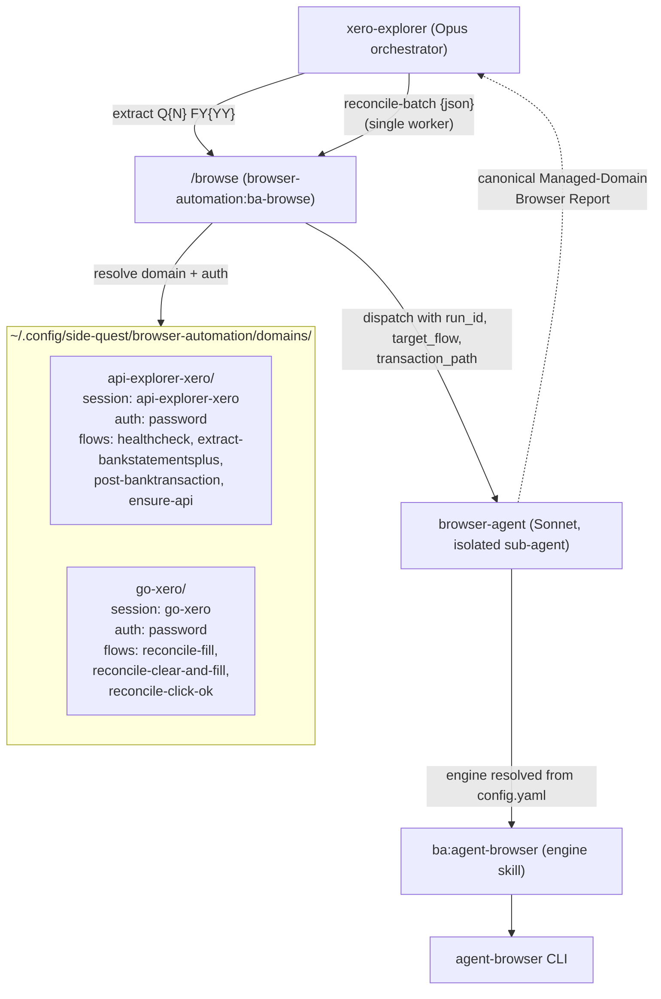

# Retrofit xero-cli Browser Automation onto `/browse`

## Overview

Retire xero-cli's two domain-specific browser sub-agents (`xero-extract-agent`, `xero-reconcile-agent`) and the two repo-local skills they load (`xero-api-explorer`, `xero-reconcile`). Route all browser dispatch through the canonical `browser-automation:ba-browse` (`/browse`) skill from the browser-automation plugin v0.8.1. Migrate domain knowledge from `docs/gotchas/browser-agent/{api-explorer-xero,go-xero}.md` into canonical managed-domain folders under `~/.config/side-quest/browser-automation/domains/`. Reconcile collapses from N parallel workers to one worker, enforced by `/browse`'s same-domain concurrency rule.

## Problem Frame

xero-cli's current browser automation is a bespoke stack built before the canonical `/browse` contract existed:

- Two specialised sub-agents (`xero-extract-agent` Sonnet, `xero-reconcile-agent` Haiku) each shell out to the `agent-browser` CLI directly via `--auto-connect` (or `--session xero-N` for parallel workers).
- Two repo-local skills (`xero-api-explorer`, `xero-reconcile`) carry domain recipes as inline `agent-browser` command cascades.
- Domain gotchas live in `docs/gotchas/browser-agent/{api-explorer-xero,go-xero}.md`.
- Each agent independently runs the Chrome Connection Protocol, identity checks (mostly absent), and session/auth dance.

The `browser-automation` plugin (v0.8.1) now ships a canonical `/browse` dispatcher that owns domain routing, scaffold creation, identity verification, cold-start reset, irreversible-action gates, and a structured `canonical-managed-domain@1` Browser Report contract. Every other domain in Nathan's browser fleet (`iteraterecruitment-oncoreservices`, `manpowergroup-fasttrack360`) already lives there. Xero is the lone holdout.

**Why now:**
1. **Single source of truth.** Gotchas, selectors, scripts, and playbooks stop drifting between repo and `~/.config`.
2. **Safety gates.** `/browse` enforces identity verification, session isolation, irreversible-action checks, and concurrency rules that the bespoke agents skip.
3. **Composability.** Future Xero tenants and other projects inherit the same auth/identity/write-back flow for free.
4. **Structured report contract.** Canonical Write-back Candidates, Resume, and Metrics blocks make orchestration (Opus → browser-agent) more reliable than the current free-form Browser Report.
5. **Harness alignment.** Matches the global `browser-session-safety.md` rule (named sessions, shared Chrome 9223) that xero-cli currently half-implements.

**Intended outcome:** `xero-explorer` (Opus orchestrator) dispatches `/browse` via the Skill tool instead of spawning specialised agents. Xero domain knowledge lives in `~/.config/side-quest/browser-automation/domains/{api-explorer-xero,go-xero}/`. Reconcile is single-worker; restoring parallel reconcile waits for upstream to support same-domain parallel sessions.

## Requirements Trace

- **R1.** All browser dispatch from xero-cli workflows goes through `/browse` (`browser-automation:ba-browse`). No remaining direct invocations of `xero-extract-agent` or `xero-reconcile-agent`.
- **R2.** Both `xero-api-explorer` and `xero-reconcile` skill files are deleted; both agent files are deleted; `docs/gotchas/browser-agent/` files are deleted (their content lives in `~/.config` after migration).
- **R3.** Quarter-scale extraction via `/browse api-explorer.xero.com extract-bankstatementsplus` produces an NDJSON output file equivalent to the current Q4 FY25 baseline (~287 statement lines for Apr 1 – Jun 30, 2025) and feeds `scripts/xero-convert.py` unchanged.
- **R4.** Single-worker reconcile via `/browse go.xero.com reconcile-batch` correctly fills Who/What and clicks OK on a test batch, with the resulting reconcile count visible in the canonical report's `### Findings` section.
- **R5.** Three load-bearing gotchas from MEMORY.md are preserved verbatim in the migrated domain files: `type` command UUID parse failure, git-safety hook blocking inline interpreters, and synchronous/foreground execution requirement.
- **R6.** The throughput regression (parallel → single worker) is documented in MEMORY.md with a tracking note for upstream feature restoration.
- **R7.** `bun run validate` passes after the retirement; `grep` for the retired identifiers across `.claude`, `docs`, `scripts`, `src` returns zero results.

## Scope Boundaries

**Out of scope:**
- No `xero-cli` CLI behaviour change. `transactions`, `reconcile` prep, state file (`data/.xero-reconcile-state.json`), and account-code handling are untouched.
- No Finance API behaviour change. The four extraction recipes (Healthcheck, BankStatementsPlus extract, POST BankTransaction, ensure-API-selected) are preserved verbatim — only the dispatch mechanism moves.
- No upstream patch to the `browser-automation` plugin. Same-domain parallel session support is tracked as a follow-up note in MEMORY.md, not implemented here.
- Zoom and Confluence skills (`zoom-transcription-agent`, `confluence-scraper-agent`) live in `~/.claude/agents/`, not this repo, and are out of scope.
- No Xero tenant migration. This retrofit assumes Nathan's single existing Xero login.

## Context & Research

### Relevant Code and Patterns

**Files to retire:**
- `.claude/skills/xero-api-explorer/SKILL.md` — agent-browser recipes for `api-explorer.xero.com`
- `.claude/skills/xero-reconcile/SKILL.md` — agent-browser recipes for `go.xero.com`
- `.claude/agents/xero-extract-agent.md` (model: sonnet)
- `.claude/agents/xero-reconcile-agent.md` (model: haiku)
- `docs/gotchas/browser-agent/api-explorer-xero.md`
- `docs/gotchas/browser-agent/go-xero.md`
- `scripts/xero-browser-healthcheck.sh` (after grep confirms no other callers)

**Workflows to update:**
- `.claude/skills/xero-explorer/SKILL.md` — orchestrator entry
- `.claude/skills/xero-explorer/workflows/extract.md` — quarter extraction dispatch
- `.claude/skills/xero-explorer/workflows/browser-reconcile.md` — UI reconcile dispatch
- `.claude/skills/xero-explorer/workflows/reconcile.md` — rapid-fire API POST path
- `.claude/skills/xero-explorer/workflows/csv-review.md` — any agent-browser references

**Files preserved unchanged:**
- `src/reconcile.ts` (and the rest of the CLI)
- `scripts/xero-convert.py` — NDJSON conversion stays the same
- `data/.xero-reconcile-state.json` — state file format unchanged

**Reference templates** (read before scaffolding domains):
- `~/.config/side-quest/browser-automation/domains/manpowergroup-fasttrack360/` — full structure: `manpowergroup-fasttrack360.md`, `selectors.yaml`, `scripts/`, `playbooks/`, four target flows
- `~/.config/side-quest/browser-automation/domains/iteraterecruitment-oncoreservices/` — simpler example with `login.js` credential-injection pattern and identity verification

**Plugin contract files** (read before Phase 2):
- `~/.claude/plugins/cache/side-quest-engineering/browser-automation/0.8.1/skills/ba-browse/SKILL.md`
- `~/.claude/plugins/cache/side-quest-engineering/browser-automation/0.8.1/skills/ba-browse/new-domain-protocol.md`
- `~/.claude/plugins/cache/side-quest-engineering/browser-automation/0.8.1/skills/ba-agent-browser/SKILL.md`
- `~/.claude/plugins/cache/side-quest-engineering/browser-automation/0.8.1/skills/ba-agent-browser/auth-flows.md`

### Institutional Learnings

`docs/solutions/` carries no prior art for browser-skill retrofits. The single existing solutions file (`docs/solutions/integration-issues/xero-bank-statement-lines-vs-transactions.md`) is unrelated background. Three load-bearing learnings live in MEMORY.md and the global rule set instead:

1. **`type` command breaks on UUIDs** (MEMORY.md). Values like `601e62a1-...` get parsed as CSS selectors. Migrated reconcile recipes must keep using `fill @ref "value"` for fields that may receive UUIDs.
2. **git-safety hook blocks inline interpreters** (MEMORY.md). `python3 -c "..."` and heredoc patterns are rejected. Login scripts and helpers must be standalone files in `scripts/`, never inline.
3. **Background task race condition** (MEMORY.md). `agent-browser` commands must run synchronously/foreground; background mode causes silent extraction failures. Any wrappers in the new domain folders must enforce this.
4. **Same-domain parallelism is forbidden** (`/Users/nathanvale/code/claude-code-config/rules/browser-session-safety.md`): *"Agents must not run concurrently on the same domain — sessions share cookies (no BrowserContext isolation). Two agents on the same domain will see each other's auth state. Tracked upstream: vercel-labs/agent-browser#1068."* This is the canonical justification for collapsing reconcile to one worker.

### External References

- vercel-labs/agent-browser#1068 — upstream issue tracking same-domain session isolation. No implementation timeline.
- 1Password CLI `op read 'op://vault/item/field'` — credential staging pattern, used by `iteraterecruitment-oncoreservices/scripts/login.js` and reusable here.

## Key Technical Decisions

- **Full retrofit, no legacy fallback.** Both agents and both skills are retired in one pass. Rationale: a partial split (extraction on `/browse`, parallel reconcile on legacy) creates two code paths that drift. One code path is simpler to maintain even at the cost of single-worker reconcile.
- **Drop parallelism for reconcile.** Single-worker reconcile is the new normal. Rationale: `/browse` enforces same-domain concurrency rules, and the throughput cost is acceptable since `OBSERVE-REASON-ACT-VERIFY` reduces retry churn. Restoration is gated on upstream — tracked in MEMORY.md.
- **Service config: global.** Xero entries land in `~/.config/side-quest/browser-automation/config.yaml` alongside existing `iteraterecruitment-oncoreservices` and `manpowergroup-fasttrack360`. Rationale: matches existing pattern; domain knowledge already lives at `~/.config`, so co-locating config is consistent. Repo-level `.browser-agent.yaml` would split config from sibling services for no clear gain.
- **Auth: `password` + 1Password.** Both Xero domains use `auth: password` with the same `op_item` UUID (one Xero login covers both subdomains). Rationale: enables identity verification, cookie-state checks, and unattended runs. The `auth: none` alternative (rely on existing Chrome cookies) is simpler today but loses identity gating and breaks if cookies expire mid-run.
- **Bootstrap is Nathan-driven, not automated.** Phase 1 has Nathan run `/browse <domain> bootstrap` interactively to invoke the new-domain protocol. Rationale: the protocol asks vendor/identity/MFA questions that need a human; scripting bootstrap would duplicate `/browse`'s own logic.
- **Parallel-restoration tracking is local-only.** A `project_browse_parallel_followup.md` memory tracks the constraint. Rationale: filing an upstream GitHub issue is heavier-weight than the constraint warrants today; revisit if it bites.
- **Phase 6 retirement is gated on a real quarter run.** Delete the legacy files only after one full Q-extract and one reconcile dry-run pass cleanly through `/browse`. Rationale: rollback safety. All earlier phases are additive.

## Open Questions

### Resolved During Planning

- **Parallel reconcile posture.** Resolved: drop parallelism, full retrofit. (See Key Technical Decisions.)
- **Service config scope.** Resolved: global `~/.config/side-quest/browser-automation/config.yaml`.
- **Auth mode.** Resolved: `auth: password` + 1Password op_item.
- **Upstream follow-up venue.** Resolved: MEMORY.md only, no upstream issue.
- **Retirement trigger.** Resolved: after one full quarter dry-run through `/browse` passes cleanly.

### Deferred to Implementation

- **Exact Xero `op_item` UUID.** Captured by Nathan during Phase 1 bootstrap and added to `~/.config/side-quest/browser-automation/config.yaml` then. Not knowable from the plan.
- **MFA posture.** Default is `auth: password`; upgrade to `auth: password_totp` only if Xero login prompts for TOTP during Phase 1 bootstrap. Decided at first login.
- **Whether `scripts/xero-browser-healthcheck.sh` has any external callers.** Resolved by `grep -r xero-browser-healthcheck .claude src docs scripts` immediately before Unit 6's deletion step.
- **Whether `go-xero` needs a separate `login.js` from `api-explorer-xero`.** The two subdomains may share an SSO flow or may diverge. Decided after observing the actual login forms during Phase 1 bootstrap.
- **Exact selector fingerprints for the Reconcile page.** Captured during the first real reconcile-batch run via `/browse`'s staged-candidate flow; promoted from `candidate` to `validated` after two successful runs.
- **Whether the new `/browse`-driven extract path produces a byte-identical NDJSON to the current path.** Likely yes since both call the same Finance API endpoint, but validated empirically during Unit 5 verification.

## High-Level Technical Design

> *This illustrates the intended dispatch shape and is directional guidance for review, not implementation specification. The implementing agent should treat it as context, not code to reproduce.*



Three structural shifts vs today:

1. **Specialised agents collapse into the generic `browser-agent`** loaded by `/browse`. Domain knowledge moves out of skills and into `~/.config` domain folders.
2. **Parallelism path disappears.** The `--session reconcile-worker-N` fan-out in `browser-reconcile.md` becomes a single dispatch.
3. **Output contract becomes structured.** Free-form Browser Report becomes the canonical `canonical-managed-domain@1` report with `### Write-back Candidates`, `### Resume`, and `### Metrics` blocks that the orchestrator can parse reliably.

## Implementation Units

- [ ] **Unit 1: Bootstrap canonical domain scaffolds (Nathan-driven, prerequisite)**

**Goal:** Create the two canonical managed-domain folders for `api-explorer.xero.com` and `go.xero.com` via `/browse`'s new-domain protocol, with `auth: password` service entries pointing at the Xero 1Password item.

**Requirements:** R1 (prerequisite — `/browse` cannot dispatch to a domain that doesn't exist).

**Dependencies:** None. This is the prerequisite to every other unit.

**Files:**
- Create: `~/.config/side-quest/browser-automation/domains/api-explorer-xero/api-explorer-xero.md`
- Create: `~/.config/side-quest/browser-automation/domains/go-xero/go-xero.md`
- Modify: `~/.config/side-quest/browser-automation/config.yaml` (add two `services:` entries)

**Approach:**
- Nathan runs `/browse api-explorer.xero.com bootstrap` and answers the new-domain prompts: vendor = Xero, auth = password, op_item = the Xero login UUID in `API Credentials` vault, expected identity = Nathan's Xero email, intended task = "Finance API extraction".
- Nathan repeats for `/browse go.xero.com bootstrap` with intended task = "Reconcile UI automation". Both subdomains share the same `op_item` UUID.
- If Xero prompts for MFA during the first login, Nathan upgrades the service entry to `auth: password_totp` (1Password TOTP).
- This unit is **not Claude's work**. Claude's job is to confirm the verification gate below before starting Unit 2.

**Execution note:** Nathan-driven; this unit is the human gate before Claude begins the retrofit.

**Patterns to follow:**
- `~/.config/side-quest/browser-automation/domains/iteraterecruitment-oncoreservices/iteraterecruitment-oncoreservices.md` — simpler reference for the `auth: password` + identity-verification pattern.
- `~/.config/side-quest/browser-automation/domains/manpowergroup-fasttrack360/manpowergroup-fasttrack360.md` — full reference for target-flow catalog, selectors registry, scripts and playbooks.

**Test scenarios:**
- Test expectation: none — bootstrap is interactive scaffold creation, no behavioral code changes to test. Verification is the structural gate below.

**Verification:**
- `~/.config/side-quest/browser-automation/domains/api-explorer-xero/api-explorer-xero.md` exists with `domain_format_version: 1` in the frontmatter.
- `~/.config/side-quest/browser-automation/domains/go-xero/go-xero.md` exists with `domain_format_version: 1` in the frontmatter.
- `~/.config/side-quest/browser-automation/config.yaml` contains both `api-explorer-xero` and `go-xero` service entries with `auth: password`, `op_item`, and `op_vault: "API Credentials"`.
- A `bootstrap-observe` run has been recorded in each domain's `## Iteration Log`.

---

- [ ] **Unit 2: Migrate gotchas + load-bearing learnings into domain markdowns**

**Goal:** Move the existing repo gotchas into the canonical domain files as the starting `## Domain Gotchas` content, and add the three load-bearing learnings from MEMORY.md that aren't yet documented anywhere.

**Requirements:** R5.

**Dependencies:** Unit 1 (domain folders must exist).

**Files:**
- Read: `docs/gotchas/browser-agent/api-explorer-xero.md`
- Read: `docs/gotchas/browser-agent/go-xero.md`
- Read: `MEMORY.md` (Agent-Browser Gotchas section)
- Modify (via `/browse` staged-candidate write-back, not direct edit): `~/.config/side-quest/browser-automation/domains/api-explorer-xero/api-explorer-xero.md`
- Modify (via `/browse` staged-candidate write-back): `~/.config/side-quest/browser-automation/domains/go-xero/go-xero.md`

**Approach:**
- For each domain, copy the corresponding `docs/gotchas/browser-agent/*.md` content into the `## Domain Gotchas` section under maturity = `legacy`. Legacy entries get re-validated to `validated` after two successful runs on that domain.
- Add three previously undocumented gotchas to `## Domain Gotchas` with maturity = `validated` (they're already proven in production):
  1. *(go-xero)* `agent-browser type @ref` breaks on UUID values — they're parsed as CSS selectors. Use `fill @ref "value"` instead.
  2. *(both)* The git-safety hook in this repo blocks `python3 -c` and heredoc patterns. Helper logic must be standalone scripts referenced via `scripts/` paths.
  3. *(both)* `agent-browser` commands must run synchronously/foreground. Background tasks cause silent extraction failures.
- Writes go through `/browse`'s staged-candidate flow per the canonical contract — Claude does not edit `~/.config` files directly.

**Patterns to follow:**
- The `## Domain Gotchas` structure in `~/.config/side-quest/browser-automation/domains/manpowergroup-fasttrack360/manpowergroup-fasttrack360.md` (categorised validated/candidate/legacy entries with reproduction notes).

**Test scenarios:**
- Test expectation: none — knowledge migration with no executable code. Verification is content presence.

**Verification:**
- `grep -l "type.*UUID\|CSS selector"` against `~/.config/side-quest/browser-automation/domains/go-xero/go-xero.md` returns a hit.
- All content from `docs/gotchas/browser-agent/{api-explorer-xero,go-xero}.md` is present in the corresponding domain markdown (sample-grep three distinctive phrases from each).
- The three MEMORY.md learnings are present in the appropriate domain files (sample-grep one distinctive phrase per learning).

---

- [ ] **Unit 3: Port extraction recipes into target flows on `api-explorer-xero`**

**Goal:** Translate the four reusable command cascades from `.claude/skills/xero-api-explorer/SKILL.md` into target flows on the `api-explorer-xero` domain, with playbooks and scripts staged via `/browse`'s write-back flow.

**Requirements:** R3.

**Dependencies:** Unit 1, Unit 2.

**Files:**
- Read: `.claude/skills/xero-api-explorer/SKILL.md`
- Stage (via `/browse` write-back): `~/.config/side-quest/browser-automation/domains/api-explorer-xero/scripts/healthcheck.js`
- Stage: `~/.config/side-quest/browser-automation/domains/api-explorer-xero/playbooks/extract-bankstatementsplus.yaml`
- Stage: `~/.config/side-quest/browser-automation/domains/api-explorer-xero/scripts/copy-response.js`
- Stage: `~/.config/side-quest/browser-automation/domains/api-explorer-xero/playbooks/post-banktransaction.yaml`
- Stage: `~/.config/side-quest/browser-automation/domains/api-explorer-xero/scripts/ensure-api.js`
- Stage: `~/.config/side-quest/browser-automation/domains/api-explorer-xero/selectors.yaml`

**Approach:**

Each existing recipe maps to one target flow:

| Current recipe (skill) | New target flow | Asset(s) |
|---|---|---|
| Healthcheck (snapshot + title check) | `healthcheck` | `scripts/healthcheck.js` |
| Finance API cascade (Org → BankStatementsPlus → date range → copy) | `extract-bankstatementsplus` | `playbooks/extract-bankstatementsplus.yaml` + `scripts/copy-response.js` |
| POST BankTransaction | `post-banktransaction` | `playbooks/post-banktransaction.yaml` |
| Ensure API is selected | `ensure-api` | `scripts/ensure-api.js` |

- All staged assets start at maturity `candidate` and declare `allowed_flows`. They promote to `validated` after two successful runs on the same target flow.
- The dropdown-cascade pattern (Organisation → API → Endpoint → Date Range) is captured in the playbook as ordered steps with selector fingerprints from `selectors.yaml`.
- Page fingerprints (title contains, required text) live in `selectors.yaml` so flows can verify they're on the right page before acting.

**Execution note:** Stage via `/browse` write-back; do not direct-edit `~/.config`. The canonical contract requires the engine to record provenance for every asset.

**Patterns to follow:**
- `~/.config/side-quest/browser-automation/domains/manpowergroup-fasttrack360/playbooks/fill-week.yaml` — playbook structure with `inputs`, `execution.script_path`, `verification.script_path`.
- `~/.config/side-quest/browser-automation/domains/manpowergroup-fasttrack360/selectors.yaml` — `canonical_assets`, `page_fingerprints`, `pages` sections.
- The script return shape from `~/.config/side-quest/browser-automation/domains/manpowergroup-fasttrack360/scripts/list-timesheets.js` (JSON with explicit error path).

**Test scenarios:**
- Happy path — Healthcheck: `/browse api-explorer.xero.com healthcheck` returns canonical report `Status: SUCCESS` with `Findings.title` containing "API Explorer".
- Happy path — Extract: `/browse api-explorer.xero.com extract-bankstatementsplus 2025-04-01..2025-06-30` returns `Status: SUCCESS` with `Findings.response_path` pointing at a staged JSON file containing `statements[].statementLines[]`.
- Happy path — Ensure-API: `/browse api-explorer.xero.com ensure-api Finance` correctly switches the API dropdown if it isn't already on Finance.
- Edge case — Extract with empty date range (e.g., a future quarter): returns `Status: PARTIAL` or empty `statementLines`, not a hard failure.
- Edge case — Extract with > 12-month range: per existing learning (Xero caps at 12 months), the playbook should pre-validate and return `Status: FAILED` with a clear error before hitting the API.
- Error path — Session expired mid-cascade: identity verification catches it, returns `Status: NEEDS_HUMAN` with a `Resume` block carrying `resume_run_id`.
- Error path — Healthcheck against unauthenticated session: returns `Status: NEEDS_HUMAN` with login screenshot.

**Verification:**
- All four target flows are listed in `api-explorer-xero.md`'s `## Target Flows` section with `auth_required: yes` and `expected_identity: <Nathan's Xero email>`.
- A test extract for a known small date range produces an NDJSON file that matches the byte count and statementLineID set of an extract run via the legacy path.
- `scripts/xero-convert.py` consumes the `/browse` extract output without modification.

---

- [ ] **Unit 4: Port single-worker reconcile recipes into target flows on `go-xero`**

**Goal:** Translate the three reusable command cascades from `.claude/skills/xero-reconcile/SKILL.md` into target flows on the `go-xero` domain, single-worker only.

**Requirements:** R4.

**Dependencies:** Unit 1, Unit 2.

**Files:**
- Read: `.claude/skills/xero-reconcile/SKILL.md`
- Stage (via `/browse` write-back): `~/.config/side-quest/browser-automation/domains/go-xero/scripts/reconcile-click-ok.js`
- Stage: `~/.config/side-quest/browser-automation/domains/go-xero/playbooks/reconcile-fill.yaml`
- Stage: `~/.config/side-quest/browser-automation/domains/go-xero/playbooks/reconcile-clear-and-fill.yaml`
- Stage: `~/.config/side-quest/browser-automation/domains/go-xero/selectors.yaml`

**Approach:**

| Current recipe | New target flow | Asset |
|---|---|---|
| `CLICK_OK` (bank rule pre-validated) | `reconcile-click-ok` | `scripts/reconcile-click-ok.js` |
| `FILL` (Who/What + OK) | `reconcile-fill` | `playbooks/reconcile-fill.yaml` |
| `CLEAR_AND_FILL` (wrong bank rule) | `reconcile-clear-and-fill` | `playbooks/reconcile-clear-and-fill.yaml` |
| Session-timeout detection | (handled by engine identity check) | — |
| Counting (read reconcile tab header) | (captured in each report's `### Findings`) | — |

**Critical preserved behaviours:**
- `fill` for the Who field (sets value directly).
- `type` + `press Enter` for the What dropdown (triggers Xero's React filter). Never `fill` for What.
- Refs (`@eN`) change after every DOM mutation — every step takes a fresh snapshot before interacting.
- `clear-and-fill` flow uses `fill @WHAT_REF ""` to clear, never `type ""`.

**Single-worker constraint:** Both playbooks declare `concurrency: single` and reference the same session name (`go-xero`). No `worker-N` suffix variants.

**Execution note:** Single worker only. Parallel reconcile is parked until upstream supports same-domain sessions; tracked in MEMORY.md after Unit 7.

**Patterns to follow:**
- `~/.config/side-quest/browser-automation/domains/manpowergroup-fasttrack360/playbooks/fill-week.yaml` — playbook structure.
- The `OBSERVE-REASON-ACT-VERIFY` loop required by `ba-agent-browser` (snapshot before every interaction).

**Test scenarios:**
- Happy path — `reconcile-click-ok` on a single line: returns `Status: SUCCESS`, `Findings.reconcile_count` decremented by 1, `Findings.lines_processed: 1`.
- Happy path — `reconcile-fill` with Who="Test Vendor" What="804": Who field shows "Test Vendor", What dropdown shows the account-804 row, OK clicks succeed.
- Happy path — `reconcile-clear-and-fill` with What="400": pre-existing What value is cleared, "400" typed, dropdown filters to account 400, Enter selects, OK clicks.
- Edge case — Batch of 3 lines processed sequentially: each line takes a fresh snapshot before interacting, refs are not stale, all 3 succeed.
- Edge case — Batch where line 2 has the same vendor name as line 1: positional matching (first line = first set of fields) selects the correct line.
- Error path — Session expired (URL changes away from `go.xero.com/BankRec/`): returns `Status: NEEDS_HUMAN` with the screenshot path.
- Error path — UUID supplied as the What value: `fill` is used (not `type`), so the gotcha is avoided. Test confirms the playbook never calls `type` on the What field.
- Integration — After `reconcile-click-ok`, the next playbook step takes a fresh snapshot and confirms the line has animated away (count in tab header decremented).

**Verification:**
- All three target flows are listed in `go-xero.md`'s `## Target Flows` section.
- A test reconcile-batch of 1–3 lines run via `/browse` decreases the reconcile tab counter by the expected amount, verified by manual UI inspection.
- `selectors.yaml` includes a `page_fingerprint` for the BankRec page (URL pattern `go.xero.com/BankRec/BankRec.aspx`, required text "Reconcile (").

---

- [ ] **Unit 5: Rewire `xero-explorer` workflows to dispatch via `/browse`**

**Goal:** Update all four `xero-explorer` workflows so they call `/browse` via the Skill tool instead of dispatching the legacy sub-agents. Remove all references to parallel reconcile workers.

**Requirements:** R1, R3, R4, R6.

**Dependencies:** Unit 3, Unit 4.

**Files:**
- Modify: `.claude/skills/xero-explorer/SKILL.md`
- Modify: `.claude/skills/xero-explorer/workflows/extract.md`
- Modify: `.claude/skills/xero-explorer/workflows/browser-reconcile.md`
- Modify: `.claude/skills/xero-explorer/workflows/reconcile.md`
- Modify: `.claude/skills/xero-explorer/workflows/csv-review.md`

**Approach:**

- **`extract.md`:** Replace `Agent(xero-extract-agent, ...)` dispatch with `Skill("browser-automation:ba-browse", "api-explorer.xero.com extract-bankstatementsplus Q{N} FY{YY} ({start_date}..{end_date})")`. Parse the returned canonical report's `### Findings` for the response file path, then feed to `scripts/xero-convert.py` as today.
- **`browser-reconcile.md`:** Single-path:
  ```
  Skill("browser-automation:ba-browse", "go.xero.com reconcile-batch {json}")
  ```
  Remove all references to `--session reconcile-worker-N` and parallel dispatch. Add a banner at the top of the file noting the throughput regression and pointing readers at the MEMORY.md tracking note (`project_browse_parallel_followup.md`) for future restoration.
- **`reconcile.md`** (rapid-fire API POST path): Replace the `xero-extract-agent` dispatch with `/browse` targeting `api-explorer-xero` + `post-banktransaction` target flow.
- **`csv-review.md`:** Update any `agent-browser` references to use `/browse`. Most of this file is non-browser, so the diff is small.
- **`xero-explorer/SKILL.md`:** Update the architecture overview to remove mentions of `xero-extract-agent` / `xero-reconcile-agent` and describe the `/browse` dispatch model instead.

**Patterns to follow:**
- Existing Skill tool invocations elsewhere in the harness for syntax reference.
- The frontmatter pattern in `~/.claude/plugins/cache/side-quest-engineering/browser-automation/0.8.1/skills/ba-browse/SKILL.md` for the expected `/browse` invocation shape.

**Test scenarios:**
- Happy path — Extract workflow dry-run end-to-end against a known small date range produces NDJSON output equivalent to the legacy path (compare statementLineID sets).
- Happy path — Browser-reconcile workflow dispatched against a small test batch returns the canonical report and decrements the reconcile count.
- Happy path — Reconcile (rapid-fire POST) workflow dispatches a single POST BankTransaction via `/browse` and returns `Status: SUCCESS`.
- Edge case — Workflow file references no longer mention `xero-extract-agent` or `xero-reconcile-agent` (grep check).
- Edge case — `browser-reconcile.md` references no `worker-N` session names and no parallel dispatch (grep check for `worker-` and `--session reconcile`).
- Error path — `/browse` returns `Status: NEEDS_HUMAN`: the workflow surfaces the resume metadata (`resume_run_id`, `human_action`, `screenshot_path`) clearly to the user instead of failing silently.
- Integration — After Phase 1 bootstrap and Units 3–4, an extract dispatched from `extract.md` actually reaches the playbook in `~/.config` and produces output (not a "domain not found" error from `/browse`).

**Verification:**
- `grep -r "xero-extract-agent\|xero-reconcile-agent" .claude/skills/xero-explorer` returns zero results.
- `grep -rE "reconcile-worker|--session reconcile" .claude/skills/xero-explorer` returns zero results.
- One full quarter dry-run of the extract workflow produces NDJSON that `scripts/xero-convert.py` consumes cleanly.
- One small test reconcile batch through `browser-reconcile.md` updates the Xero UI as expected.

---

- [ ] **Unit 6: Retire legacy skills, agents, gotchas, and helper script**

**Goal:** Delete the bespoke skills, sub-agents, gotchas files, and obsolete helper script. Run a final grep sweep to catch stragglers.

**Requirements:** R2, R7.

**Dependencies:** Unit 5 (must be merged and one full quarter dry-run must pass cleanly first — see Key Technical Decisions).

**Files:**
- Delete: `.claude/skills/xero-api-explorer/SKILL.md`
- Delete: `.claude/skills/xero-reconcile/SKILL.md`
- Delete: `.claude/agents/xero-extract-agent.md`
- Delete: `.claude/agents/xero-reconcile-agent.md`
- Delete: `docs/gotchas/browser-agent/api-explorer-xero.md`
- Delete: `docs/gotchas/browser-agent/go-xero.md`
- Delete (conditional): `scripts/xero-browser-healthcheck.sh`

**Approach:**
- Before deleting `scripts/xero-browser-healthcheck.sh`, run `grep -r xero-browser-healthcheck .claude src docs scripts` to confirm no other callers. If there's a CLI-level caller outside the retired agents, keep the script and update it to call `/browse` instead.
- After deletions, run `grep -r "xero-api-explorer\|xero-extract-agent\|xero-reconcile-agent\|xero-reconcile" .claude docs scripts src` to catch any dangling references in workflow files, comments, or docs. Clean any hits (the only remaining mention should be in this plan and in MEMORY.md retirement notes).
- If `docs/gotchas/browser-agent/` becomes empty after the two deletions, remove the empty directory.

**Patterns to follow:**
- Conventional commit format for the deletion commit: `refactor(browser): retire legacy xero browser skills and agents in favor of /browse`.

**Test scenarios:**
- Test expectation: none — pure deletion. Verification is the grep sweep + `bun run validate`.

**Verification:**
- `bun run validate` passes (lint + types + build + tests, per CLAUDE.md).
- `grep -r "xero-api-explorer\|xero-extract-agent\|xero-reconcile-agent\|xero-reconcile" .claude docs scripts src` returns zero results (other than the retirement entries in MEMORY.md and the references in this plan file).
- One additional full quarter extraction + reconcile pass runs cleanly end-to-end after the deletions.

---

- [ ] **Unit 7: Update memory and project documentation**

**Goal:** Update MEMORY.md and `.claude/CLAUDE.md` to reflect the new dispatch model, the parallelism trade-off, and the upstream-restoration tracking note.

**Requirements:** R6.

**Dependencies:** Unit 6.

**Files:**
- Modify: `MEMORY.md` (the index in `/Users/nathanvale/.claude/projects/-Users-nathanvale-code-side-quest-xero-cli/memory/MEMORY.md`)
- Create: `/Users/nathanvale/.claude/projects/-Users-nathanvale-code-side-quest-xero-cli/memory/feedback_browse_retrofit.md`
- Create: `/Users/nathanvale/.claude/projects/-Users-nathanvale-code-side-quest-xero-cli/memory/project_browse_parallel_followup.md`
- Modify: `/Users/nathanvale/.claude/projects/-Users-nathanvale-code-side-quest-xero-cli/memory/project_active_quarter.md` (only if it references retired agents)
- Modify: `/Users/nathanvale/.claude/projects/-Users-nathanvale-code-side-quest-xero-cli/memory/project_xero_unreconcile_constraint.md` (only if it references retired agents)
- Modify: `.claude/CLAUDE.md` (project instructions — add `/browse`-only flow note and parallelism trade-off paragraph)

**Approach:**

- **`feedback_browse_retrofit.md`** (feedback type): Lead with the rule — "All xero browser dispatch goes through `/browse` (`browser-automation:ba-browse`); never invoke `agent-browser` CLI directly from xero-cli workflows or skills." **Why:** retired bespoke agents to gain identity verification, structured reports, and single-source-of-truth domain knowledge. **How to apply:** when editing `.claude/skills/xero-explorer/workflows/*` or thinking about adding browser automation, dispatch via `Skill("browser-automation:ba-browse", ...)`.
- **`project_browse_parallel_followup.md`** (project type): Lead with the constraint — "Reconcile is single-worker because `/browse` forbids two agents on the same domain. Parallel reconcile restoration is gated on upstream support for same-domain parallel sessions (vercel-labs/agent-browser#1068, no timeline)." **Why:** plugin v0.8.1 enforces this for cookie/auth race safety. **How to apply:** if reconcile throughput becomes a bottleneck again, revisit by either filing the upstream issue or accepting the constraint indefinitely.
- **MEMORY.md index**: Add two new entries under appropriate sections; remove or update any stale references to retired agents in the existing entries.
- **`.claude/CLAUDE.md`**: Add a short paragraph under a new "Browser Automation" section explaining the `/browse`-only flow, the single-worker constraint, and pointing at the two new memory files.

**Patterns to follow:**
- Existing memory file frontmatter and "Why / How to apply" structure documented in the harness `auto memory` instructions.
- Conventional commit: `docs(memory): record /browse retrofit and parallelism follow-up`.

**Test scenarios:**
- Test expectation: none — documentation update.

**Verification:**
- `MEMORY.md` index lists `feedback_browse_retrofit.md` and `project_browse_parallel_followup.md` under one-line hooks.
- Both new memory files exist with correct frontmatter (`type: feedback` and `type: project` respectively).
- A fresh session loads MEMORY.md and the new entries appear in context (verified by spot-checking the auto-loaded index).
- `.claude/CLAUDE.md` mentions `/browse` as the dispatch path for xero browser work.

## System-Wide Impact

- **Interaction graph:** The orchestration shape changes: `xero-explorer` (Opus) → `Skill("browser-automation:ba-browse", ...)` → `browser-agent` (Sonnet, isolated) → `ba:agent-browser` engine → `agent-browser` CLI. Today's path goes Opus → `Agent(xero-extract-agent | xero-reconcile-agent)` → bash → `agent-browser` CLI directly. The middle layers change but the leaf CLI invocations remain the same.
- **Error propagation:** Today's free-form Browser Report becomes the canonical `canonical-managed-domain@1` report with structured Status, Resume, and Write-back Candidates blocks. Workflow code in `xero-explorer/workflows/*` must learn to parse the new shape (currently parses ad-hoc text).
- **State lifecycle risks:** `/browse` introduces caller-owned transaction directories under `~/.local/state/side-quest/browser-automation/runs/{run_id}` for staged writes. If a run is interrupted mid-batch, the `run_id` lets it resume — but only if the orchestrator preserves the `run_id` across retries. The current bespoke path has no such concept; resume is implicit via the `data/.xero-reconcile-state.json` state file. The two state mechanisms are complementary, not conflicting.
- **API surface parity:** No xero-cli CLI surface changes. `bun run validate`, `xero-cli reconcile`, `xero-cli transactions` all behave identically. The only consumer-facing change is the format of orchestrator status messages from `xero-explorer` workflows.
- **Integration coverage:** The full extract → convert → review → reconcile pipeline must still work end-to-end. Verified in Unit 5 (extract dry-run) and Unit 6 (final quarter pass). Unit-level tests on individual playbooks won't prove this — only the end-to-end run does.
- **Unchanged invariants:**
  - `xero-cli` command surface, flags, and exit codes — untouched.
  - `data/.xero-reconcile-state.json` schema and `BankTransactionID` keying — untouched.
  - `scripts/xero-convert.py` NDJSON contract — untouched.
  - The Xero Finance API request shape for `BankStatementsPlus` — untouched (same scope, same envelope `statements[].statementLines[]`).
  - Account-code classification rules in `feedback_show_account_names.md` and `project_reconciliation_rules.md` — untouched; they live in MEMORY.md and continue to inform Opus's classification step.

## Risks & Dependencies

| Risk | Mitigation |
|------|------------|
| `/browse` dispatch is materially slower than direct `agent-browser` calls due to extra agent hops, making quarter extracts painful. | Measure on the first quarter dry-run (Unit 5 verification). If unacceptable, escalate before Unit 6 retirement. The plan is reversible until Unit 6. |
| Single-worker reconcile is too slow for active Q4 FY25 pipeline (currently mid-flight per MEMORY.md). | Run the Q4 FY25 reconcile to completion via the legacy path *before* starting Unit 5. Then retrofit cleanly during a quieter window. (Add to Phase 1 prerequisites.) |
| Migrated playbooks miss subtle behaviour from the imperative skill recipes (e.g., timing waits, fresh-snapshot cadence). | Stage assets as `candidate`, not `validated`. Promote only after two successful runs. The canonical contract enforces this. |
| Xero's login flow uses MFA or hardware key, breaking the `auth: password` plan. | Phase 1 bootstrap surfaces this immediately. Fallback to `auth: password_totp` if 1Password TOTP works; otherwise accept `NEEDS_HUMAN` pauses on cold-start and revisit. |
| `/browse`'s same-domain concurrency rule is enforced more strictly than expected and blocks even sequential batched runs. | The plugin's rule is "no two *concurrent* agents on the same domain" — sequential runs are explicitly fine. Tested on `iteraterecruitment-oncoreservices` and `manpowergroup-fasttrack360` which already work this way. |
| The three load-bearing MEMORY.md gotchas get lost during the migration (Unit 2). | Unit 2 verification step explicitly grep-checks for distinctive phrases from each gotcha in the destination file. |
| `scripts/xero-browser-healthcheck.sh` has external callers beyond the retired agents. | Unit 6 explicitly greps before deleting. If callers exist, keep the script and update it to call `/browse`. |
| `op_item` lookup fails at runtime (1Password CLI unauthenticated, vault renamed, item moved). | First Phase 1 bootstrap run validates `op read` end-to-end. Later runs benefit from `/browse`'s identity-verification fallback to `NEEDS_HUMAN`. |

**Dependencies / prerequisites:**
- Plugin `browser-automation` v0.8.1 installed and loaded (already true).
- 1Password CLI (`op`) installed and authenticated (already true per existing oncore/manpower domain usage).
- Nathan available to run `/browse <domain> bootstrap` interactively (Unit 1).
- Q4 FY25 reconcile pipeline either complete or pausable before Unit 5.
- One full quarter window to dry-run extract + reconcile through `/browse` before Unit 6 retirement.

## Documentation / Operational Notes

- **`.claude/CLAUDE.md`** (project instructions) gains a new "Browser Automation" section after Unit 7. Brief — point at the two new memory files for detail.
- **MEMORY.md** is the source of truth for the parallelism trade-off and the dispatch rule (Unit 7).
- **No upstream issue filed.** If parallelism becomes painful, file against `vercel-labs/agent-browser` referencing issue #1068.
- **Rollback plan:** Units 1–5 are additive. If `/browse` misbehaves, revert the workflow changes from Unit 5 (single commit) and the legacy agents/skills are still intact. After Unit 6, rollback requires `git revert` of the deletion commit.
- **No CI changes.** `bun run validate` is the same gate; no new pipelines.
- **No data migration.** Existing `data/.xero-reconcile-state.json` and extracted NDJSONs continue to work.

## Sources & References

- Related code:
  - `.claude/skills/xero-explorer/SKILL.md` and `.claude/skills/xero-explorer/workflows/*.md`
  - `.claude/skills/xero-api-explorer/SKILL.md`, `.claude/skills/xero-reconcile/SKILL.md`
  - `.claude/agents/xero-extract-agent.md`, `.claude/agents/xero-reconcile-agent.md`
  - `docs/gotchas/browser-agent/api-explorer-xero.md`, `docs/gotchas/browser-agent/go-xero.md`
  - `scripts/xero-browser-healthcheck.sh`, `scripts/xero-convert.py`
- Related plans:
  - `docs/plans/2026-03-05-feat-finance-api-statement-line-reconciliation-plan.md`
  - `docs/plans/2026-03-10-feat-csv-roundtrip-reconciliation-plan.md`
- Plugin contract:
  - `~/.claude/plugins/cache/side-quest-engineering/browser-automation/0.8.1/skills/ba-browse/SKILL.md`
  - `~/.claude/plugins/cache/side-quest-engineering/browser-automation/0.8.1/skills/ba-browse/new-domain-protocol.md`
  - `~/.claude/plugins/cache/side-quest-engineering/browser-automation/0.8.1/skills/ba-agent-browser/SKILL.md`
  - `~/.claude/plugins/cache/side-quest-engineering/browser-automation/0.8.1/skills/ba-agent-browser/auth-flows.md`
- Reference domains:
  - `~/.config/side-quest/browser-automation/domains/iteraterecruitment-oncoreservices/`
  - `~/.config/side-quest/browser-automation/domains/manpowergroup-fasttrack360/`
- Global rules:
  - `/Users/nathanvale/code/claude-code-config/rules/browser-session-safety.md`
- Project memory:
  - `/Users/nathanvale/.claude/projects/-Users-nathanvale-code-side-quest-xero-cli/memory/MEMORY.md` (Agent-Browser Gotchas section)
- Upstream tracking:
  - vercel-labs/agent-browser#1068 — same-domain session isolation
